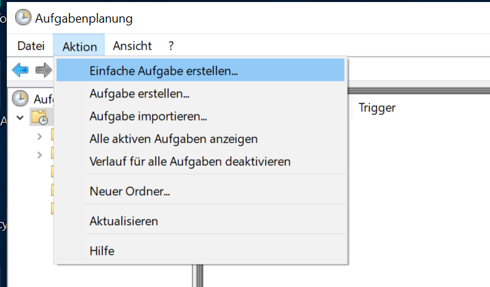

# Automated Python Script Execution
This demonstrates how to configure a Windows system to execute a certain task (here: run an python script) automatically.

## 1.Step: Write python code
in our small example, the code we'd like to execute is stored in ``script.py``.

## 2. Step write caller script
By default, the Windows system executes `*.bat` files. 
We therefore write a .bat script  `caller_script.bat` which executes the above python file.

## 3. Step Schedule an OS-Event
We first run the 'Aufgabenplanung' app.
 

Then, create a new simple event.

 

Use the assistent to navigate through the setup. Give a name

set an interval

 

and start day.

 

Define what to do

 

and plug in the path to the caller script from above.

 

You finally get a review field. You get check the checkbox to see more settings.

 

here you can define more triggers in cae you'd like to run the scipt multiple times a day: 
Use the 'new' button to add more.

You can also edit the current event and set a repitition rate. Therefore click on 'bearbeiten'  

and set further repetitions. 

 

## 4. Step: You're done
Happy scripting :)

# Disclaimer
IPA 2020 for internal uses
